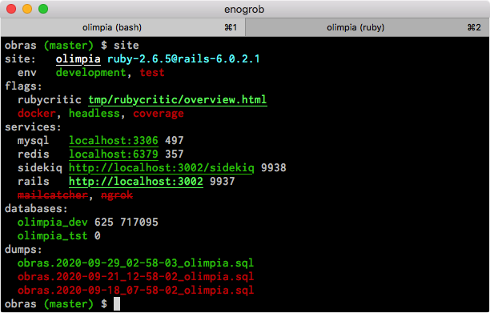
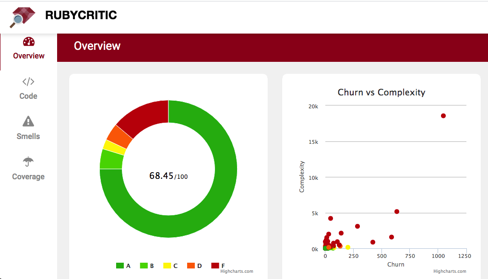

```
Roberto Nogueira  
BSd EE, MSd CE
Solution Integrator Experienced - Certified by Ericsson
```
# Research Assess Code in Rails


**About**

Here are some guidelines and articles about this subject.



---

My suggestion is to use first **Rubocop** in order to cleanup the offenses (see process just below). Later on with **RubyCritic** and also with **Rubocop** but on a codereview/refactoring based activities.

```
$ rubocop --format offenses
``` 

Once they are listed, they can be arranged in a to-do list disabled at first generated in a file by the following commands and then it is possible cope with them little by little:

```
$ rubocop --auto-gen-config
$ rubocop .
:
$ ls -la .*.yml
:
-rw-r--r--  1 enogrob  staff  77011 Sep 29 12:55 .rubocop_todo.yml
```



---

**Refs:**

* [1] [**Research Repository** in Github](https://github.com/enogrob/research-assess-code-in-rails)
* [2] [**Three Awesome Libraries to Assess Code Quality in Ruby**](https://www.fastruby.io/blog/ruby/quality/code-quality-ruby-gems.html)
* [3] [**Legacy Rails: Silently Judging You**](https://www.fastruby.io/blog/upgrade-rails/legacy-rails-silently-judging-you.html)
* [4] [**rubycritic**](https://github.com/whitesmith/rubycritic)
* [5] [**rubocop**](https://github.com/rubocop-hq/rubocop)
* [6] [**rubocop-rails**](https://github.com/rubocop-hq/rubocop-rails/)
* [7] [**Rubocop’s --auto-gen-config**](https://leonelgalan.com/2020/02/26/rubocops-auto-gen-config.html)

