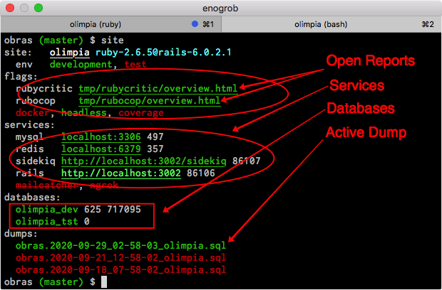

```
Roberto Nogueira  
BSd EE, MSd CE
Solution Integrator Experienced - Certified by Ericsson
```
# Research Assess Code in Rails


**About**

Here are some guidelines and articles about this subject.



---

My suggestion is to use first **Rubocop** in order to cleanup the offenses (see process just below). Later on with **RubyCritic** and also with **Rubocop** but on a codereview/refactoring based activities.

```
$ rubocop --format offenses
:
52684   Style/StringLiterals
39214   Layout/SpaceInsideHashLiteralBraces
8482    Style/NumericLiterals
8249    Layout/IndentationConsistency
6529    Rails/SkipsModelValidations
2822    Style/FrozenStringLiteralComment
2342    Layout/SpaceAfterComma
2219    Layout/IndentationStyle
2196    Style/Documentation
1987    Layout/TrailingWhitespace
1681    Layout/IndentationWidth
1280    Layout/SpaceInsideBlockBraces
1276    Style/HashSyntax
1126    Style/RedundantSelf
1091    Rails/Present
1079    Layout/SpaceAroundOperators
1029    Layout/ExtraSpacing
941     Layout/LeadingCommentSpace
865     Style/IfUnlessModifier
791     Layout/SpaceInsideArrayLiteralBrackets
759     Layout/HashAlignment
710     Layout/SpaceAfterColon
681     Style/RedundantInterpolation
641     Layout/SpaceInsideParens
622     Style/NegatedIf
617     Layout/ArrayAlignment
605     Layout/FirstArrayElementIndentation
558     Metrics/AbcSize
552     Style/SymbolArray
527     Metrics/MethodLength
447     Layout/SpaceBeforeBlockBraces
436     Metrics/BlockNesting
403     Layout/EmptyLines
393     Layout/EmptyLineBetweenDefs
384     Style/AsciiComments
371     Style/GuardClause
335     Style/SafeNavigation
327     Layout/FirstHashElementIndentation
309     Layout/SpaceInsideStringInterpolation
307     Rails/HasManyOrHasOneDependent
287     Style/ClassAndModuleChildren
269     Lint/UselessAssignment
265     Metrics/CyclomaticComplexity
253     Metrics/PerceivedComplexity
250     Layout/SpaceBeforeComma
224     Style/ConditionalAssignment
221     Rails/TimeZone
214     Style/IdenticalConditionalBranches
206     Layout/CaseIndentation
204     Rails/LexicallyScopedActionFilter
193     Style/NumericLiteralPrefix
176     Rails/BulkChangeTable
174     Style/GlobalVars
169     Layout/EmptyLinesAroundMethodBody
168     Style/StringLiteralsInInterpolation
162     Layout/EmptyLinesAroundClassBody
160     Metrics/BlockLength
158     Style/EmptyMethod
157     Layout/MultilineOperationIndentation
150     Layout/EmptyLinesAroundAccessModifier
149     Rails/ContentTag
144     Layout/ArgumentAlignment
136     Layout/TrailingEmptyLines
135     Style/SymbolProc
119     Rails/Presence
110     Style/Next
108     Rails/ReversibleMigration
104     Layout/CommentIndentation
96      Style/EmptyLiteral
96      Style/PercentLiteralDelimiters
94      Style/SelfAssignment
92      Layout/SpaceAroundBlockParameters
92      Rails/Output
88      Style/NumericPredicate
84      Layout/EmptyLinesAroundBlockBody
83      Naming/AccessorMethodName
82      Style/BlockDelimiters
80      Style/IfInsideElse
77      Rails/HasAndBelongsToMany
75      Style/WordArray
73      Rails/UnknownEnv
67      Style/RedundantParentheses
61      Layout/EndAlignment
61      Rails/InverseOf
56      Lint/DeprecatedClassMethods
56      Rails/Blank
54      Layout/MultilineMethodCallBraceLayout
54      Lint/UnusedBlockArgument
54      Style/NestedTernaryOperator
53      Layout/SpaceAroundEqualsInParameterDefault
53      Style/Semicolon
51      Rails/FilePath
50      Lint/RescueException
49      Style/PreferredHashMethods
48      Layout/SpaceInLambdaLiteral
48      Metrics/ClassLength
48      Style/BarePercentLiterals
47      Style/RedundantReturn
45      Layout/SpaceBeforeComment
45      Style/TrailingCommaInArrayLiteral
44      Rails/OutputSafety
43      Layout/ClosingParenthesisIndentation
43      Style/ColonMethodCall
41      Rails/Date
41      Style/DoubleNegation
39      Style/RedundantCondition
38      Style/ZeroLengthPredicate
37      Layout/MultilineArrayBraceLayout
37      Rails/ActiveRecordAliases
34      Layout/SpaceInsidePercentLiteralDelimiters
34      Style/MethodDefParentheses
34      Style/RedundantPercentQ
33      Rails/DynamicFindBy
33      Rails/HelperInstanceVariable
33      Rails/HttpStatus
33      Style/AndOr
32      Naming/FileName
31      Layout/AccessModifierIndentation
31      Layout/DefEndAlignment
31      Style/RedundantBegin
31      Style/RescueStandardError
30      Style/ClassCheck
29      Naming/PredicateName
28      Layout/SpaceBeforeFirstArg
28      Naming/VariableName
28      Style/CommandLiteral
27      Security/Open
26      Layout/EmptyLineAfterGuardClause
25      Style/Not
25      Style/TrailingCommaInHashLiteral
24      Style/MutableConstant
23      Layout/BlockAlignment
23      Layout/MultilineMethodCallIndentation
23      Lint/SuppressedException
22      Layout/ElseAlignment
22      Rails/UniqueValidationWithoutIndex
21      Lint/UnusedMethodArgument
21      Style/MethodCallWithoutArgsParentheses
21      Style/TernaryParentheses
19      Rails/RedundantForeignKey
18      Layout/EmptyLinesAroundModuleBody
18      Lint/ShadowingOuterLocalVariable
17      Layout/SpaceAroundKeyword
17      Lint/RedundantStringCoercion
17      Naming/VariableNumber
17      Style/CommentedKeyword
17      Style/UnlessElse
16      Lint/IneffectiveAccessModifier
16      Naming/HeredocDelimiterNaming
15      Layout/DotPosition
15      Layout/LeadingEmptyLines
15      Lint/ParenthesesAsGroupedExpression
15      Style/ClassVars
15      Style/RegexpLiteral
14      Style/Lambda
14      Style/ParenthesesAroundCondition
14      Style/PerlBackrefs
13      Layout/FirstArgumentIndentation
13      Layout/MultilineHashBraceLayout
13      Rails/PluralizationGrammar
13      Style/FormatString
13      Style/MultilineIfModifier
12      Rails/FindBy
11      Lint/AmbiguousBlockAssociation
11      Lint/Void
11      Naming/ConstantName
11      Rails/CreateTableWithTimestamps
11      Style/BlockComments
10      Layout/EmptyLinesAroundExceptionHandlingKeywords
10      Lint/DuplicateCaseCondition
10      Naming/MethodParameterName
10      Style/InverseMethods
10      Style/MultipleComparison
9       Layout/HeredocIndentation
9       Lint/AssignmentInCondition
9       Rails/Validation
9       Style/FormatStringToken
8       Lint/SendWithMixinArgument
8       Style/PercentQLiterals
8       Style/Proc
7       Layout/SpaceBeforeSemicolon
7       Layout/SpaceInsideArrayPercentLiteral
7       Metrics/ModuleLength
7       Naming/MemoizedInstanceVariableName
7       Style/For
6       Layout/BlockEndNewline
6       Layout/EmptyComment
6       Layout/EmptyLinesAroundBeginBody
6       Layout/MultilineBlockLayout
6       Lint/UselessAccessModifier
6       Style/CaseEquality
6       Style/EachWithObject
6       Style/MultilineTernaryOperator
5       Layout/SpaceAfterMethodName
5       Layout/SpaceAfterNot
5       Lint/AmbiguousRegexpLiteral
5       Rails/ApplicationRecord
5       Style/MissingRespondToMissing
5       Style/MultilineBlockChain
5       Style/TrailingCommaInArguments
4       Layout/ClosingHeredocIndentation
4       Lint/NonDeterministicRequireOrder
4       Style/NilComparison
4       Style/RedundantConditional
3       Lint/DuplicateMethods
3       Lint/ShadowedException
3       Naming/AsciiIdentifiers
3       Naming/MethodName
3       Rails/NotNullColumn
3       Style/DefWithParentheses
3       Style/EmptyElse
3       Style/ExpandPathArguments
3       Style/OptionalArguments
3       Style/RedundantSort
3       Style/Strip
3       Style/WhileUntilDo
3       Style/WhileUntilModifier
3       Style/YodaCondition
2       Layout/AssignmentIndentation
2       Layout/EmptyLineAfterMagicComment
2       Layout/RescueEnsureAlignment
2       Layout/SpaceAfterSemicolon
2       Layout/SpaceInsideReferenceBrackets
2       Lint/BigDecimalNew
2       Lint/LiteralAsCondition
2       Lint/ScriptPermission
2       Lint/UriRegexp
2       Metrics/ParameterLists
2       Rails/RefuteMethods
2       Rails/UniqBeforePluck
2       Security/JSONLoad
2       Security/YAMLLoad
2       Style/EmptyCaseCondition
2       Style/Encoding
2       Style/FloatDivision
2       Style/InfiniteLoop
2       Style/MixinUsage
2       Style/MultilineWhenThen
2       Style/NonNilCheck
2       Style/SpecialGlobalVars
2       Style/StructInheritance
1       Layout/EmptyLinesAroundArguments
1       Lint/AmbiguousOperator
1       Lint/BooleanSymbol
1       Lint/Debugger
1       Lint/EmptyWhen
1       Lint/InterpolationCheck
1       Lint/NestedMethodDefinition
1       Lint/RequireParentheses
1       Naming/RescuedExceptionsVariableName
1       Rails/RakeEnvironment
1       Rails/RequestReferer
1       Style/Alias
1       Style/IfUnlessModifierOfIfUnless
1       Style/MethodMissingSuper
1       Style/MixinGrouping
1       Style/MultilineIfThen
1       Style/NegatedUnless
1       Style/NestedParenthesizedCalls
1       Style/OrAssignment
1       Style/RedundantCapitalW
--
157016  Total
``` 

Once they are listed, they can be arranged in a to-do list disabled at first generated in a file by the following commands and then it is possible cope with them little by little:

```
$ rubocop --auto-gen-config
$ rubocop .
:
$ ls -la .*.yml
:
-rw-r--r--  1 enogrob  staff  77011 Sep 29 12:55 .rubocop_todo.yml
```


---

**Refs:**

* [1] [**Research Repository** in Github](https://github.com/enogrob/research-assess-code-in-rails)
* [2] [**Three Awesome Libraries to Assess Code Quality in Ruby**](https://www.fastruby.io/blog/ruby/quality/code-quality-ruby-gems.html)
* [3] [**Legacy Rails: Silently Judging You**](https://www.fastruby.io/blog/upgrade-rails/legacy-rails-silently-judging-you.html)
* [4] [**rubycritic**](https://github.com/whitesmith/rubycritic)
* [5] [**rubocop**](https://github.com/rubocop-hq/rubocop)
* [6] [**rubocop-rails**](https://github.com/rubocop-hq/rubocop-rails/)
* [7] [**Rubocop’s --auto-gen-config**](https://leonelgalan.com/2020/02/26/rubocops-auto-gen-config.html)

